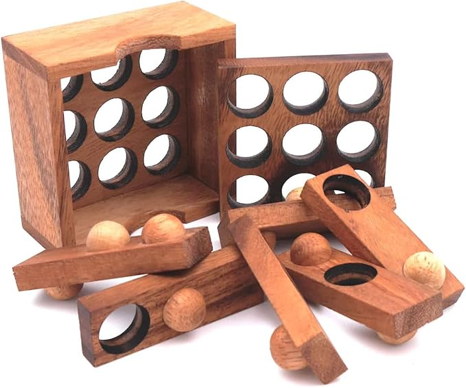
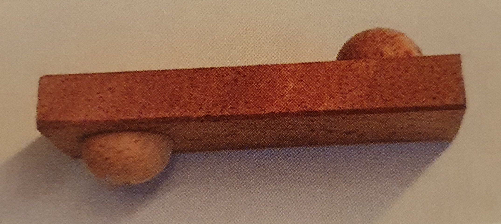
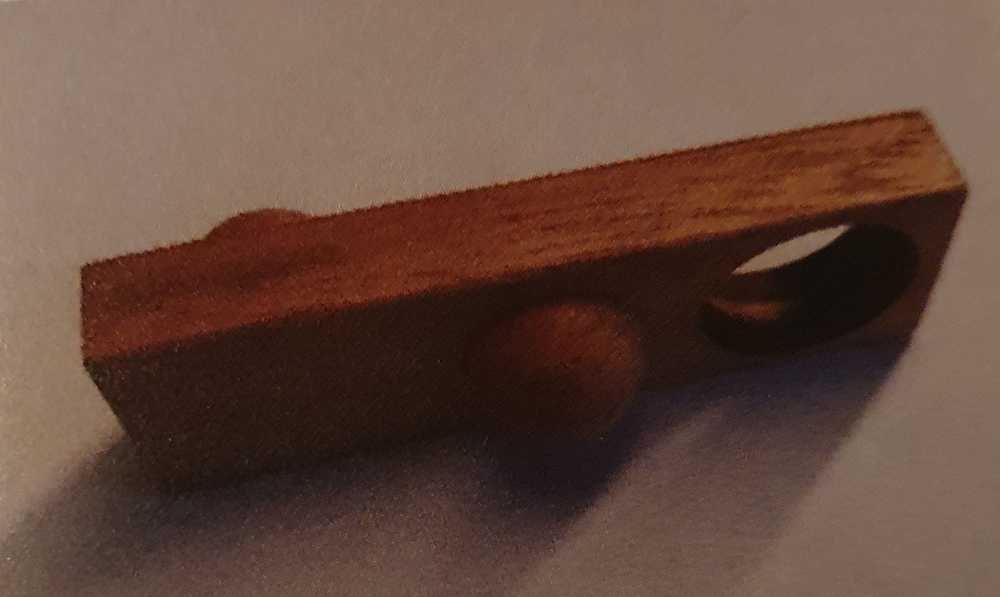

# AP-2024
Software developer final exam 2024 implementation in C#.

This implementation was part of my final exam, here you can see my original implementation.

There is also a rust implementation of this project, although it's not nearly as polished as this one.

For the rust implementation, see here: https://github.com/ChrizziDerKek/AP-2024-Rust

## Task definition
- Your company created a wooden puzzle with a cubic box and multiple layers
  
- There are puzzle pieces with the same length as the box and the width 1
- If the box length and width is n, a piece will also have n cells
- These cells can be empty or contain a hole on both sides or a hemisphere on either one or both sides
  
  
- The pieces get turned by 90° in each layer
- Because of the hemispheres on the pieces, they can only be arranged like that
  1) Hemisphere on hole
  2) Empty on empty
  3) Empty on hole
  4) Hole on hole
- The lowest layer has holes everywhere so that any piece can be placed on it
- Puzzle pieces can be turned in any direction
- Example: ``Up, Down, Hole`` can be turned into
  1) ``Down, Up, Hole`` (Turned 90° vertically)
  2) ``Hole, Down, Up`` (Turned 90° horizontally)
  3) ``Hole, Up, Down`` (Turned 90° in both directions)
- Now the company wants you to write a program which reads an input of puzzle pieces and finds a valid solution for the puzzle

## Program requirements
1) Import data: Reading the box size, number of layers and puzzle pieces from an input file
2) Store data: Storing said data in a suiting data structure
3) Solving: Determining a possible solution in compliance with the rules defined by the task definition
4) Output: Creating an output file with the solution

## Input example
```
//**********************************************
//Example 1
//**********************************************
Dimension 3,3,2
A 1,2,1
B 2,0,1
C 2,1,0
D 2,0,0
E 2,2,1
F 0,1,2
```

1) ``Line 1 - 3``: There can be comments starting with ``//`` which should appear in the output too
2) ``Line 4``: Defines the box size and number of layers, length and width should always match
3) ``Line 5-10``: Defines puzzle pieces with a label (single uppercase letter) and the encoded cells
4) ``Encoding``:
   0) Hole on both sides of the piece
   1) Hemisphere on top of the piece, empty at the bottom
   2) Hemisphere at the bottom of the piece, empty on top
   3) Hemisphere on both sides
   4) Empty on both sides
  
## Output example
```
//**********************************************
//Example 1
//**********************************************
Dimension 3,3,2
Piece placement
Layer 2
1 1 2 E
0 2 1 F
1 0 0 D

Layer 1
2 2 0
1 0 2
2 1 1
A B C
```

1) ``Line 1 - 3``: Comments from the input file
2) ``Line 4 - 5``: Dimensions from the input file
3) ``Line 6``: Layers from top to bottom of the box
4) ``Line 7 - 9``: Turned pieces in the current layer with their encoding
5) ``Line 11 - 15``: Non-turned layer with its pieces and their encoding

## Solving algorithm
Solving the problem by using a recursive backtracking algorithm
```cs
/// <summary>
/// Backtracking-Algorithmus zum Suchen einer Loesung fuer das Puzzle
/// </summary>
/// <param name="teil">Gibt an, das wievielte Puzzleteil eingefuegt wird</param>
/// <param name="loesung">Loesung-Objekt, das kopiert werden soll</param>
/// <returns>Wahr wenn eine Loesung gefunden wurde</returns>
private bool Loesen(int teil, Loesung loesung)
{
    //Aktuelle Loesung kopieren, damit wir
    //bei einem fehlgeschlagenen Versuch
    //zurueckgehen koennen (Backtracking)
    Loesung kopie = new Loesung(loesung);
    //Zuletzt eingefuegtes Puzzleteil
    //wird aus Kopie entfernt
    if (teil > 0)
        kopie.EntferneTeil(teil - 1);
    //Wenn keine Puzzleteile mehr uebrig sind,
    //haben wir eine Loesung gefunden
    if (kopie.teile.Count <= 0)
        return true;
    //Alle verfuegbaren Teile und deren Permutationen durchgehen
    for (int i = 0; i < kopie.teile.Count; i++)
    {
        Teil[] permutationen = kopie.teile[i].GetPermutationen();
        for (int j = 0; j < permutationen.Length; j++)
        {
            //Ebene und Stelle fuers aktuelle Teil finden
            int ebene = GetTeilEbene(teil);
            int stelle = GetTeilStelle(teil);
            //Pruefen, ob das Teil an der aktuellen Stelle passt
            if (box.IstErlaubt(permutationen[j], ebene, stelle))
            {
                //Wenn ja, einfuegen
                box.Einfuegen(permutationen[j], ebene, stelle);
                //Und den Ablauf fuer das naechste Teil
                //wiederholen und die Kopie des Loesung-
                //Objekts uebergeben, bis eine Teilloesung
                //gefunden wurde
                if (Loesen(teil + 1, kopie))
                    return true;
            }
        }
    }
    //Alle Teile wurden geprueft und
    //keins davon hat gepasst
    return false;
}
```
